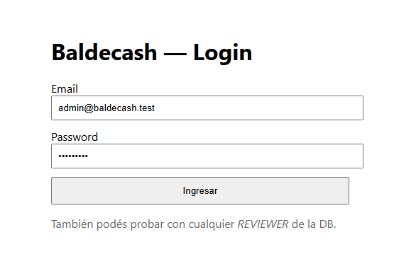
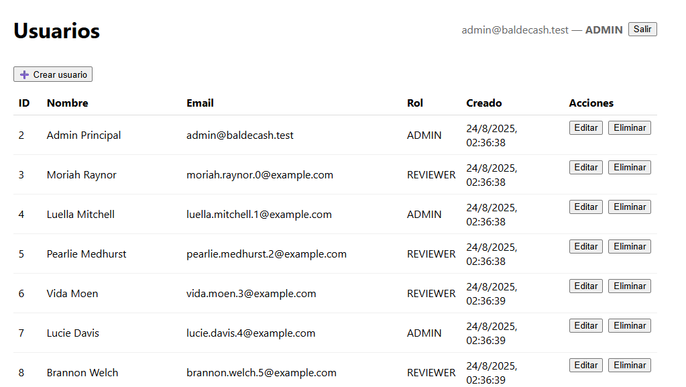
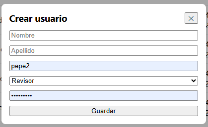
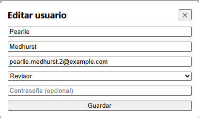
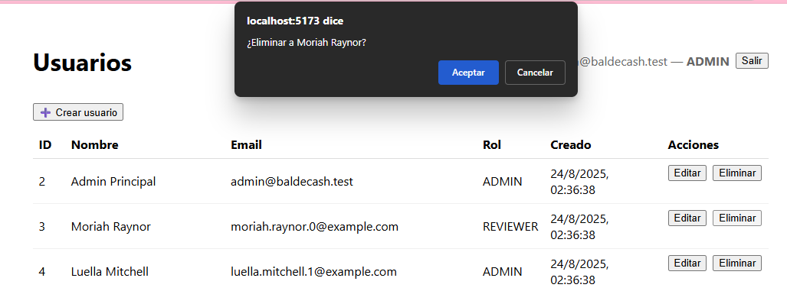

# 🪣 Baldecash — Frontend

Frontend de la prueba técnica **Baldecash** desarrollado con [Vite](https://vitejs.dev/), [React](https://react.dev/), [TypeScript](https://www.typescriptlang.org/) y [Axios](https://axios-http.com/).

## 🚀 Funcionalidades

- **Login** con email y password.  
- Persistencia de sesión en `localStorage` (token JWT).  
- **Protección de rutas**: sin token, se redirige a `/login`.  
- **Roles**:
  - `ADMIN`: puede **crear, editar y eliminar** usuarios.
  - `REVIEWER`: solo puede **ver el listado**.  
- **CRUD de usuarios**:
  - Listado en tabla con ID, nombre, email, rol y fecha de creación.
  - Modal para **crear usuario** (contraseña obligatoria).
  - Modal para **editar usuario** (contraseña opcional).
  - Eliminación con confirmación.  
- **Logout**: limpia token y redirige a `/login`.  
- Manejo automático de expiración (401 → redirige a login).

## 📂 Estructura de carpetas

frontend/
├─ src/
│ ├─ api.ts # configuración axios + token
│ ├─ usersApi.ts # funciones CRUD de usuarios
│ ├─ App.tsx # rutas con react-router-dom
│ ├─ pages/
│ │ ├─ Login.tsx
│ │ └─ Users.tsx
│ ├─ components/
│ │ ├─ Modal.tsx
│ │ └─ UserForm.tsx
│ └─ main.tsx
├─ .env # variables de entorno (VITE_API_URL)
├─ package.json
└─ vite.config.ts

## ⚙️ Configuración

### Variables de entorno
Crear un archivo `.env` en la carpeta `frontend/` con:
VITE_API_URL=http://localhost:3000


> Para producción, usar `.env.production` con la URL real de la API.

### Instalación
```bash
cd frontend
npm install


Desarrollo
npm run dev


Build
npm run build


🔑 Usuarios de prueba

Admin

Email: admin@baldecash.test

Password: Admin123!

Reviewer

Email: cualquiera de los REVIEWER cargados en la DB

Password: Password123! (ejemplo según seed)

🛠️ Tecnologías

React + Vite

TypeScript

Axios

React Router DOM
```  

📸 Capturas de pantalla

### Login


### Listado de usuarios (ADMIN)


### Crear usuario


### Editar usuario


### Eliminar usuario

